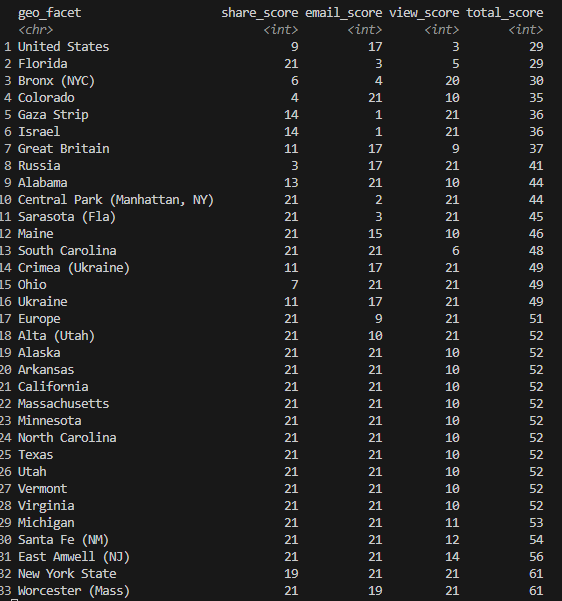

# Overview

In this assignment, we will be scraping data from the [NY Times API](https://developer.nytimes.com/apis).

## 1. Collecting the data

We'll be getting data from the most emailed, shared, and viewed articles. We'll also attempt to build an attribution model between these three assuming that shares and emails lead to more views:

```{r, echo=FALSE}
nyt_api_key <- "jzedw6sr0ajTCMLq8GGAKSY4isxkM5m9"
```

Importing libraries:

```{r libraries}
library(jsonlite)
library(dplyr)
library(tidyr)
```

Creating a list of endpoints for our data collection. We will go back the last 30 days

```{r setting api urls}
api_urls <- list(
  email = "https://api.nytimes.com/svc/mostpopular/v2/emailed/30.json?api-key=",
  share = "https://api.nytimes.com/svc/mostpopular/v2/shared/30.json?api-key=", # nolint: line_length_linter.
  views = "https://api.nytimes.com/svc/mostpopular/v2/viewed/30.json?api-key="
)

```

```{r getting our data}
nyt_data <- list(
  email = fromJSON(paste(api_urls$email, nyt_api_key, sep = "")),
  share = fromJSON(paste(api_urls$share, nyt_api_key, sep = "")),
  views = fromJSON(paste(api_urls$views, nyt_api_key, sep = ""))
)
```

Let's take a look at the columns we have from this api:

```{r inspecting our data}
names(nyt_data$email)

names(nyt_data$share$results)
```

We can see that in the `results` part of the response we have what seems to be our data. Let's just keep that part:

```{r getting a data frame}
email <- nyt_data$email$results
share <- nyt_data$share$results
views <- nyt_data$views$results

names(share)
```

I was confused, but at this point I closely inspected the [available API Docs](https://developer.nytimes.com/portals/api/sites/nyt-devportal/liveportal/apis/most-popular-product/download_spec) and it seems that I won't be able to get any quantifiable information regarding views, emails and shares. Simply put, I am only able to get a ranked list of the most shared, emailed, and viewed stories.

Although, it was really nice that the API doc came through as a YAML file.

Since we cannot build an attribution model, let's index each article and see how relative ranks compare as well as see if there are any trends based on the geography for the highest rank items. We'll call this scoring of ranks a "geographic relevancy".

To do so, we'll create the rank at the article level and then unnest longer the geographies:

```{r getting rank}
email <- email |>
  mutate(
    email_rank = row_number()
  ) |>
  select(
    email_rank,
    title,
    section,
    subsection,
    id,
    geo_facet
  )

share <- share |>
  mutate(
    share_rank = row_number()
  ) |>
  select(
    share_rank,
    title,
    section,
    subsection,
    id,
    geo_facet
  )

views <- views |>
  mutate(
    view_rank = row_number()
  ) |>
  select(
    view_rank,
    title,
    section,
    subsection,
    id,
    geo_facet
  )

email <- unnest_longer(email, geo_facet)

share <- unnest_longer(share, geo_facet)

views <- unnest_longer(views, geo_facet)

replace_rank <- 1 + max(
  c(
    max(email$email_rank),
    max(share$share_rank),
    max(views$view_rank)
  )
)
```

Now, let's perform some data visualization. Firstly, let's see where each item shows up in their respective ranks.

To do so, and since multiple geographies can show up, I've decided to create an index where the lower the score the better. This index will be calculated by grouping on the geo_facet and then take the minimum value for their respective rank.

```{r creating a scoring index}
share_scored <- share |>
  group_by(geo_facet) |>
  summarise(share_score = min(share_rank)) |>
  select(geo_facet, share_score)

email_scored <- email |>
  group_by(geo_facet) |>
  summarise(email_score = min(email_rank)) |>
  select(geo_facet, email_score)

views_scored <- views |>
  group_by(geo_facet) |>
  summarise(view_score = min(view_rank)) |>
  select(geo_facet, view_score)
```

One important consideration are the NAs. It is entirely possible that one of the most shared or emailed articles may contain a location that isn't in one of the most viewed. To account for this, we will be filling the NAs in the score columns with `r replace_rank`. `r replace_rank` was chosen as each dataset was observed to only have `r replace_rank-1` articles.

```{r combining scores}
all_scores <- share_scored |>
  full_join(
    email_scored,
    by = "geo_facet"
  ) |>
  full_join(
    views_scored,
    by = "geo_facet"
  ) |>
  replace_na(
    list(
      email_score = replace_rank,
      share_score = replace_rank,
      view_score = replace_rank
    )
  ) |>
  mutate(
    total_score = share_score + email_score + view_score
  ) |>
  arrange(total_score)

print(all_scores, n = nrow(all_scores))
```

This type of comparison is expected to have different results every run, so in order to discuss the specific results of my run (March 19th, 2024 at around 11PM) I've included a screenshot of my results below:




From here we can see that the United States was the number one geography that was mentioned. After that, we can see that Florida was the second most "relevant". Interesting about the Florida placement was that it did not make it into the top 20 articles shared but is the third most emailed. I'm interpreting this to mean that those who are sharing articles via email are more likely to share articles about Florida. Given the climate, it's interesting that the most emailed geographies (regarding Palestine and Israel) are the most shared but are not even among the 20th most viewed articles in the last 30 days. This suggests that the overall impact that emails have on views is very low.

Another thing to note, is that the number one article by share_score and view_score is not present. Inspecting further I found that during the `unnest_longer()` function, the elements in the array which existed were completely removed.

Lastly, there were many geographies sharing rank 10, which was the article with the Super Tuesday results for the states listed.

# Conclusion

In conclusion, despite encountering limitations in building an attribution model, our analysis provided valuable insights into the relative rankings and geographical relevance of NY Times articles. We observed notable trends, such as the United States emerging as the most frequently mentioned geography, and that shares and likes don't seem to have a great impact on how many views an article will have