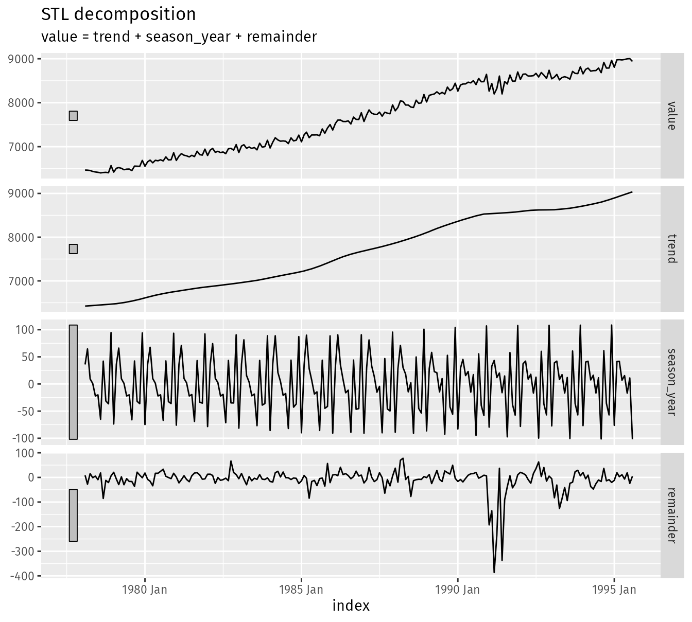
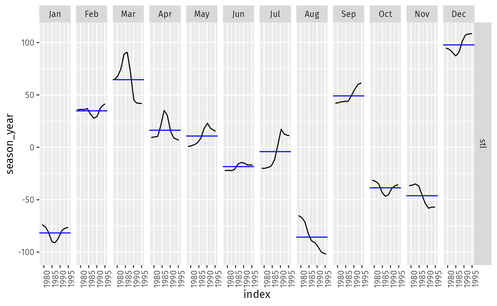

# Question 3.1
#### Consider the GDP information in global_economy. Plot the GDP per capita for each country over time. Which country has the highest GDP per capita? How has this changed over time?

# Question 3.2
For each of the following series, make a graph of the data. If transforming seems appropriate, do so and describe the effect.

#### A. United States GDP from global_economy.
#### B. Slaughter of Victorian “Bulls, bullocks and steers” in aus_livestock.
#### C. Victorian Electricity Demand from vic_elec.
#### D. Gas production from aus_production.

# Question 3.3
Why is a Box-Cox transformation unhelpful for the canadian_gas data?

# Question 3.4
What Box-Cox transformation would you select for your retail data (from Exercise 7 in Section 2.10)?

# Question 3.5
For the following series, find an appropriate Box-Cox transformation in order to stabilise the variance. Tobacco from aus_production, Economy class passengers between Melbourne and Sydney from ansett, and Pedestrian counts at Southern Cross Station from pedestrian.

# Question 3.7
Consider the last five years of the Gas data from aus_production.

gas <- tail(aus_production, 5*4) |> select(Gas)

#### A. Plot the time series. Can you identify seasonal fluctuations and/or a trend-cycle?
#### B. Use classical_decomposition with type=multiplicative to calculate the trend-cycle and seasonal indices.
#### C. Do the results support the graphical interpretation from part a?
#### D. Compute and plot the seasonally adjusted data.
#### E. Change one observation to be an outlier (e.g., add 300 to one observation), and recompute the seasonally adjusted data. What is the effect of the outlier?
#### F. Does it make any difference if the outlier is near the end rather than in the middle of the time series?

# Question 3.8
Recall your retail time series data (from Exercise 7 in Section 2.10). Decompose the series using X-11. Does it reveal any outliers, or unusual features that you had not noticed previously?

# Question 3.9 
Figures 3.19 and 3.20 show the result of decomposing the number of persons in the civilian labour force in Australia each month from February 1978 to August 1995.

Figure 3.19: Decomposition of the number of persons in the civilian labour force in Australia each month from February 1978 to August 1995.

Figure 3.20: Seasonal component from the decomposition shown in the previous figure.
#### A. Write about 3–5 sentences describing the results of the decomposition. Pay particular attention to the scales of the graphs in making your interpretation.
#### B. Is the recession of 1991/1992 visible in the estimated components?