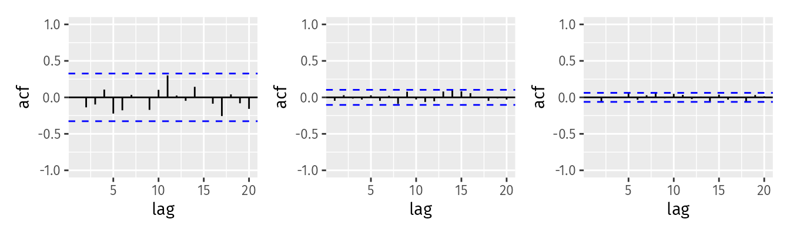

```{r setup, include=FALSE}
knitr::opts_chunk$set(echo = FALSE)
```

```{r, echo=FALSE, message=FALSE, warning=FALSE}
library(fpp3)
library(latex2exp)
```

## Question 9.1

1. Explain the differences among these figures. Do they all indicate that the data are white noise?


> Each of these graphs show the same y scale. We can use that to notice that the spread is smaller in each subsequent chart. The blue lines are fixed values where the autocorrelations would be statistically significantly different from zero (given by $\pm \dfrac{1.96}{\sqrt(T)}$ for 95% where $T$ is the length of the timeseries). These charts indicate that this data is white noise as all of the ACFs values lie between those white lines.

2. Why are the critical values at different distances from the mean of zero? Why are the autocorrelations different in each figure when they each refer to white noise?

> From the equation in the question before ($\pm \dfrac{1.96}{\sqrt(T)}$) we can see that there is a negative correlation with the magnitude of the critical value and the length of the timeseries. Therefore, as more time is provided the critical value decreases.

## Question 9.2

A classic example of a non-stationary series are stock prices. Plot the daily closing prices for Amazon stock (contained in gafa_stock), along with the ACF and PACF. Explain how each plot shows that the series is non-stationary and should be differenced.

```{r, fig.width=10, fig.height=10}
data(gafa_stock)

fb <- gafa_stock |>
  filter(Symbol == "FB")

head(fb)

fb |>
  gg_tsdisplay(
    Close,
    plot_type = "partial"
  )

fb |>
  features(
    Close,
    unitroot_kpss
  )
```

> 1. The timeseries pretty obviously has a trend which is evidence that the data is non-stationary and should be differenced.
> 2. From the above ACF plot, we can see that the graph slowly decays, which allows us to conclude that this dataset is non-stationary and should be differenced.
> 3. From the above PACF plot, we can see that there is only a strong correlation with the first lag and almost none with subsequent lags. This is an indication that the data is non-stationary and should be differenced.
> 4. Using the unit root test, we get a `kpss_pvalue` of .01, which could be a value much lower than .01 and is evidence that  the data is non-stationary.

## Question 9.3

For the following series, find an appropriate Box-Cox transformation and order of differencing in order to obtain stationary data.

> 1. For the appropriate Box-Cox transformation, we'll find the lambda and then use [the chart here](https://www.statisticshowto.com/probability-and-statistics/normal-distributions/box-cox-transformation/) to find the appropriate transformation.
> 2. In order to find the order of differencing, I'll use the unitroot_kpss feature.

1. Turkish GDP from `global_economy`.

```{r, fig.width=10, fig.height=10}
data(global_economy)
head(global_economy)

turks <- global_economy |>
  filter(Country == "Turkey") |>
  select(Year, GDP)

autoplot(turks)

turk_lg1 <- turks |>
  features(GDP, features = guerrero) |>
  pull(lambda_guerrero)

turk_lg1
```

> This timeseries has an increasing trend. With a lambda of `r round(turk_lg1, 2)`, we can use the $log(y)$ operation:

```{r, fig.width=10, fig.height=10}
turks_diff <- turks |>
  mutate(GDP = log(GDP)) |>
  features(GDP, unitroot_ndiffs)

turks_roots <- turks_diff |>
  pull(ndiffs)
```

> The kpss test recommends that we use a difference of `r turks_roots`.

```{r, fig.width=10, fig.height=10}
turks |>
  autoplot(
    log(GDP) |>
      difference(turks_roots)
  )
```

> The above plot seems fairly stationary now that it's been transformed and differenced.

2. Accommodation takings in the state of Tasmania from `aus_accommodation`.

```{r, fig.width=10, fig.height=10}
data(aus_accommodation)
head(aus_accommodation)

tassy <- aus_accommodation |>
  filter(State == "Tasmania") |>
  select(Date, Takings)

autoplot(tassy)

tassy_lg1 <- tassy |>
  features(Takings, features = guerrero) |>
  pull(lambda_guerrero)

tassy_lg1
```

> This data is seasonal and has trend. With a lambda of `r round(tassy_lg1, 2)`, we can use the $log(y)$ operation:

```{r, fig.width=10, fig.height=10}
tassy_diff <- tassy |>
  mutate(Takings = log(Takings)) |>
  features(Takings, unitroot_ndiffs)

tassy_roots <- tassy_diff |>
  pull(ndiffs)
```

> The kpss test recommends that we use a difference of `r tassy_roots`.

```{r, fig.width=10, fig.height=10}
tassy |>
  autoplot(
    log(Takings) |>
      difference(tassy_roots)
  )
```

> The above plot seems odd as it seems to oscillate around 0 like as sinusoidal wave. I'll be taking a difference of the seasonality duration (4 quarters):

```{r, fig.width=10, fig.height=10}
tassy |>
  autoplot(
    log(Takings) |>
      difference(4)
  )
```

> After doing a difference of 4, the data doesn't seem non-stationary but it did have a different shape than a sinusoidal chart. I'll be doing a first level difference on that 4th level difference below:

```{r, fig.width=10, fig.height=10}
tassy |>
  autoplot(
    log(Takings) |>
      difference(4) |>
      difference(1)
  )
```

> From here we see something that seems much more stationary.

3. Monthly sales from `souvenirs`.

```{r q33}
data(souvenirs)
head(souvenirs)

autoplot(souvenirs)

souvenirs_lg1 <- souvenirs |>
  features(Sales, features = guerrero) |>
  pull(lambda_guerrero)

souvenirs_lg1
```

> This timeseries has an increasing as well as annual seasonality. With a $\lambda$ of `r round(souvenirs_lg1, 2)`, we can use the $log(y)$ operation:

```{r, fig.width=10, fig.height=10}
souvenirs_diff <- souvenirs |>
  mutate(Sales = log(Sales)) |>
  features(Sales, unitroot_ndiffs)

souvenirs_roots <- souvenirs_diff |>
  pull(ndiffs)
```

> The kpss test recommends that we use a difference of `r souvenirs_roots`.

```{r, fig.width=10, fig.height=10}
souvenirs |>
  autoplot(
    log(Sales) |>
      difference(souvenirs_roots)
  )
```

> I am curious to see how well this would do with a difference of 12:

```{r, fig.width=10, fig.height=10}
souvenirs |>
  autoplot(
    log(Sales) |>
      difference(12)
  )
```

> After seeing this chart, I was interested to see it differenced once more, as it was done during the example and I found that it looks much better. I'm curious as to why the KPSS test didn't recommend this difference. Is this because this is a derivative difference?

```{r, fig.width=10, fig.height=10}
souvenirs |>
  autoplot(
    log(Sales) |>
      difference(12) |>
      difference(1)
  )
```

## Question 9.5

For your retail data (from Exercise 7 in Section 2.10), find the appropriate order of differencing (after transformation if necessary) to obtain stationary data.

```{r, fig.width=10, fig.height=10}
set.seed(2111994)

myseries <- aus_retail |>
  filter(`Series ID` == sample(aus_retail$`Series ID`, 1)) |>
  select(Turnover)

head(myseries)

myseries |>
  autoplot()
```

> Firstly, let's see if we'll see if we need to perform a box-cox transform.

```{r, fig.width=10, fig.height=10}
myseries_lg1 <- myseries |>
  features(Turnover, features = guerrero) |>
  pull(lambda_guerrero)
```

> A $\lambda$ of `r round(myseries_lg1, 2)` suggests that we should perform the $log(y)$ transformation. With that, we'll perform a difference that is centered around the seasonal duration (12):

```{r, fig.width=10, fig.height=10}
myseries |>
  autoplot(
    log(Turnover) |>
      difference(12)
  )
```

> Again, although this data seems pretty stationary it seems to have little trends within it. It is possible to perform another difference on the differenced data.

```{r, fig.width=10, fig.height=10}
myseries |>
  autoplot(
    log(Turnover) |>
      difference(12) |>
      difference(1)
  )
```

## Question 9.6

Simulate and plot some data from simple ARIMA models.

1. Use the following R code to generate data from an AR(1) model with $\phi = 0.6$ and ${\sigma}^2 = 1$.The process starts with $y_1 = 0$.

```{r, fig.width=10, fig.height=10}
y <- numeric(100)
e <- stats::rnorm(100)
for (i in 2:100) {
  y[i] <- 0.6 * y[i - 1] + e[i]
}
sim <- tsibble(idx = seq_len(100), y = y, index = idx)
```

2. Produce a time plot for the series. How does the plot change as you change $\phi_1$?

```{r, fig.width=10, fig.height=10}
library(patchwork)  # For arranging plots

plots <- list()

plots[[length(plots) + 1]] <- sim |>
  autoplot() +
  labs(title = TeX("AR(1) model with $\\phi$ = 0.6"))

phi1 <- -1

for (i in 2:100) {
  y[i] <- phi1 * y[i - 1] + e[i]
}
plots[[length(plots) + 1]] <- tsibble(idx = seq_len(100), y = y, index = idx) |>
  autoplot() +
  labs(title = TeX(paste("AR(1) model with $\\phi$ = ", phi1)))

phi1 <- -0.5

for (i in 2:100) {
  y[i] <- phi1 * y[i - 1] + e[i]
}
plots[[length(plots) + 1]] <- tsibble(idx = seq_len(100), y = y, index = idx) |>
  autoplot() +
  labs(title = TeX(paste("AR(1) model with $\\phi$ = ", phi1)))

phi1 <- 0

for (i in 2:100) {
  y[i] <- phi1 * y[i - 1] + e[i]
}
plots[[length(plots) + 1]] <- tsibble(idx = seq_len(100), y = y, index = idx) |>
  autoplot() +
  labs(title = TeX(paste("AR(1) model with $\\phi$ = ", phi1)))

phi1 <- 0.5

for (i in 2:100) {
  y[i] <- phi1 * y[i - 1] + e[i]
}
plots[[length(plots) + 1]] <- tsibble(idx = seq_len(100), y = y, index = idx) |>
  autoplot() +
  labs(title = TeX(paste("AR(1) model with $\\phi$ = ", phi1)))

phi1 <- 1

for (i in 2:100) {
  y[i] <- phi1 * y[i - 1] + e[i]
}
plots[[length(plots) + 1]] <- tsibble(idx = seq_len(100), y = y, index = idx) |>
  autoplot() +
  labs(title = TeX(paste("AR(1) model with $\\phi$ = ", phi1)))

wrap_plots(plots, ncol = 2, nrow = 3)
```

> Each of these phi values produce a very different plot. When $\phi = -1$ the plot seems to oscillate around 0 and when $\phi$ is in -0.6, -0.5, 0, and 0.5 it looks like a noise. When $\phi = 1$ it resembles a timeseries with a trend.

3. Write your own code to generate data from an MA(1) model with $\theta_1 = 0.6$ and ${\sigma}^2 = 1$.

```{r q63}
set.seed(19940211)

# Setting up some variables
size <- 200
theta <- 0.6

# creating a dataset of 200 numbers of 0
y63 <- numeric(size)

# creating a normal distribution of sigma^2 = 1 for the errors
errors <- rnorm(size, mean = 0, sd = 1)

for (i in 2:size) {
  y63[i - 1] <- errors[i] + theta * errors[i - 1]
}

tsibble(idx = seq_len(size), y = y63, index = idx) |>
  autoplot() +
  labs(title = TeX("MA(1) model with $\\theta_1 = 0.6$ and ${\\sigma}^2 = 1$"))
```

4. Produce a time plot for the series. How does the plot change as you change $\theta_1$?

> The MA(1) model must be between -1 and 1, therefore:
```{r, fig.width=10, fig.height=10}
ma_plots <- list()

theta <- -1

for (i in 2:size) {
  y63[i - 1] <- errors[i] + theta * errors[i - 1]
}

ma_plots[[length(ma_plots) + 1]] <- tsibble(
  idx = seq_len(size), y = y63, index = idx
) |>
  autoplot() +
  labs(title = TeX(paste("MA(1) model with $\\theta_1$ = ", theta)))

theta <- -.5

for (i in 2:size) {
  y63[i - 1] <- errors[i] + theta * errors[i - 1]
}

ma_plots[[length(ma_plots) + 1]] <- tsibble(
  idx = seq_len(size), y63 = y63, index = idx
) |>
  autoplot() +
  labs(title = TeX(paste("MA(1) model with $\\theta_1$ = ", theta)))

theta <- 0

for (i in 2:size) {
  y63[i - 1] <- errors[i] + theta * errors[i - 1]
}

ma_plots[[length(ma_plots) + 1]] <- tsibble(
  idx = seq_len(size), y = y63, index = idx
) |>
  autoplot() +
  labs(title = TeX(paste("MA(1) model with $\\theta_1$ = ", theta)))

theta <- 0.5

for (i in 2:size) {
  y63[i - 1] <- errors[i] + theta * errors[i - 1]
}

ma_plots[[length(ma_plots) + 1]] <- tsibble(
  idx = seq_len(size), y = y63, index = idx
) |>
  autoplot() +
  labs(title = TeX(paste("MA(1) model with $\\theta_1$ = ", theta)))

theta <- 1

for (i in 2:size) {
  y63[i - 1] <- errors[i] + theta * errors[i - 1]
}

ma_plots[[length(ma_plots) + 1]] <- tsibble(
  idx = seq_len(size), y = y63, index = idx
) |>
  autoplot() +
  labs(title = TeX(paste("MA(1) model with $\\theta_1$ = ", theta)))

wrap_plots(ma_plots, ncol = 2, nrow = 3)
```

> When $\theta$ is -1 or -0.5, the data seems to be more erratic and as it increases and approaches 1 the data seems to become less erratic. Aside from that, the data appears to be stationary.

5. Generate data from an ARMA(1,1) model with $\phi_1 = 0.6$, $\theta_1 = 0.6$, and ${\sigma}^2 = 1$.

```{r q5}
y_arma_1_1 <- numeric(size)
theta <- 0.6
phi <- 0.6

for (i in 2:size) {
  t_ar_component <- phi * y_arma_1_1[i - 1]
  t_ma_component <- theta * errors[i - 1]
  y_arma_1_1[i] <- errors[i - 1] + t_ar_component + t_ma_component
}

tsibble(
  idx = seq_len(size), y = y_arma_1_1, index = idx
) |>
  autoplot() +
  labs(title = TeX(paste("ARMA(1,1) model with $\\phi$ = 0.6 and $\\theta$ = 0.6"))) # nolint
```

5. Generate data from an AR(2) model with $\phi_1 = -0.8$, $\phi_2 = 0.3$, and ${\sigma}^2 = 1$. (Note that these parameters will give a non-stationary series.)

```{r, fig.width=10, fig.height=10}
y_arma_2 <- numeric(size)

phi_1 <- -0.8
phi_2 <- 0.3

for (i in 3:size) {
  t_ar_component <- phi_1 * y_arma_2[i - 1] + phi_2 * y_arma_2[i - 2]
  y_arma_2[i] <- errors[i] + t_ar_component
}

tsibble(
  idx = seq_len(size), y = y_arma_2, index = idx
) |>
  autoplot() +
  labs(title = TeX(paste("AR(2) model with $\\phi_1$ = -0.8 and $\\phi_2$ = 0.3"))) # nolint
```

6. Graph the latter two series and compare them.

> The `ARMA(1,1)` seems stationary and like noise while the AR(2) model seems like an unstable, growing in magnitude as time goes on.

## Question 9.7

Consider `aus_airpassengers`, the total number of passengers (in millions) from Australian air carriers for the period 1970-2011.

1. Use `ARIMA()` to find an appropriate ARIMA model. What model was selected. Check that the residuals look like white noise. Plot forecasts for the next 10 periods.

```{r, fig.width=10, fig.height=10}
data(aus_airpassengers)
head(aus_airpassengers)

aus_airpassengers |>
  gg_tsdisplay(
    Passengers,
    plot_type = "partial"
  )

arima_pax_auto_fit <- aus_airpassengers |>
  model(
    auto = ARIMA(Passengers)
  )

report(arima_pax_auto_fit)
```

> An ARIMA(0, 2, 1) was selected.

```{r, fig.width=10, fig.height=10}
arima_pax_auto_fit |>
  gg_tsresiduals()
```

> The above charts show the residuals where we can see on the histogram that they seem fairly normally distributed, the acf has values all below the critical value and the line plot seems to be white noise around 0, i.e. is stationary.

2. Write the model in terms of the backshift operator.

$$(1 - B)^2 y_t = (1 + (-0.896)B)\epsilon_t$$

3. Plot forecasts from an ARIMA(0,1,0) model with drift and compare these to part a.

```{r, fig.width=10, fig.height=10}
arima_pax_auto_fit |>
  forecast(h = 5) |>
  autoplot(aus_airpassengers) +
  labs(title = "Auto ARIMA() model")

aus_airpassengers |>
  model(
    arima_0_1_0 = ARIMA(Passengers ~ pdq(0, 1, 0))
  ) |>
  forecast(h = 5) |>
  autoplot(aus_airpassengers) +
  labs(title = "ARIMA(0, 1, 0)")
```

> The ARIMA(0, 1, 0) model seems to have a lower slope although much of the prediction interval seems to overlap between the two models.

4. Plot forecasts from an ARIMA(2,1,2) model with drift and compare these to parts a and c. Remove the constant and see what happens.

```{r, fig.width=10, fig.height=10}
arima_pax_auto_fit |>
  forecast(h = 5) |>
  autoplot(aus_airpassengers) +
  labs(title = "Auto ARIMA() model")

aus_airpassengers |>
  model(
    arima_2_1_2 = ARIMA(Passengers ~ pdq(2, 1, 2))
  ) |>
  forecast(h = 5) |>
  autoplot(aus_airpassengers) +
  labs(title = "ARIMA(2, 1, 2)")

aus_airpassengers |>
  model(
    arima_2_1_2 = ARIMA(Passengers ~ 0 + pdq(2, 1, 2))
  ) |>
  forecast(h = 5) |>
  autoplot(aus_airpassengers) +
  labs(title = "ARIMA(2, 1, 2)")
```

> The `ARIMA(2,1,2)` model given an error as the AR part was non stationary.

5. Plot forecasts from an ARIMA(0,2,1) model with a constant. What happens?

```{r, fig.width=10, fig.height=10}
arima_pax_auto_fit |>
  forecast(h = 5) |>
  autoplot(aus_airpassengers) +
  labs(title = "Auto ARIMA() model")

aus_airpassengers |>
  model(
    arima_2_1_2 = ARIMA(Passengers ~ pdq(0, 2, 1))
  ) |>
  forecast(h = 5) |>
  autoplot(aus_airpassengers) +
  labs(title = "ARIMA(0, 2, 1)")
```

> This is the same model that was automatically selected by calling `ARIMA()` so the results are the same.

## Question 9.8

For the United States GDP series (from `global_economy`):

1. if necessary, find a suitable Box-Cox transformation for the data;

```{r, fig.width=10, fig.height=10}
data(global_economy)
head(global_economy)

us_gdp <- global_economy |>
  filter(Code == "USA") |>
  select(Year, GDP) |>
  mutate(GDP = GDP / 1000000000000)

us_gdp |>
  autoplot() +
  labs(
    title = "Annual US GDP",
    y = " $ (in Trillions)"
  )
```

> Because there is no seasonality to the data, I believe that a Box-Cox transform is unnecessary.

2. fit a suitable ARIMA model to the transformed data using `ARIMA()`;

> I'll do so by seeing what the `ARIMA()` function recommends:

```{r, fig.width=10, fig.height=10}
gdp_fit <- us_gdp |>
  model(ARIMA(GDP))

report(gdp_fit)
```

> The function recommended an ARIMA(0, 2, 2) model.

3. try some other plausible models by experimenting with the orders chosen;

```{r, fig.width=10, fig.height=10}
us_gdp |>
  gg_tsdisplay(plot_type = "partial")
```

> From the above graph, we can see that the ACF seems to decrease linearly and the PACF has an always negative but oscillating component after the first lag.

```{r, fig.width=10, fig.height=10}
gdp_fit_manual <- us_gdp |>
  model(
    ARIMA(GDP ~ pdq(p = 1:3, d = 0:3, q = 0:3))
  )

report(gdp_fit_manual)
```

> To test different models, I allowed `p`, `d`, and `q` have values up to 3 but excluding the values that the auto generated `ARIMA()` model gave. When doing so, the function returned an ARIMA(1, 2, 1). Comparing the AICc, the auto selected model has a value of `-40.06` while the second model has one of `-39.74` which suggests that these two models perform very similarly to each other although the auto selected one does appear to be better.

4. choose what you think is the best model and check the residual diagnostics;

```{r, fig.width=10, fig.height=10}
gdp_fit |>
  gg_tsresiduals()
```

> Using the ARIMA(0, 2, 2) model, the plot above shows that all of the autocorrelations are within the threshold limits and that the distribu8tion of residuals are relatively normal. There is one notable outlier which is 2008.

5. produce forecasts of your fitted model. Do the forecasts look reasonable?

```{r, fig.width=10, fig.height=10}
gdp_fit |>
  forecast(h = 5) |>
  autoplot(us_gdp) +
  labs(
    title = "ARIMA(0, 2, 2) model of US GDP",
    y = "$ (in Trillions)"
  )
```

> This forecast seems reasonable as it continues the typical trend of growth that the US GDP has had since 1960. Testing it with the latest data from [worldbank.org](https://data.worldbank.org/indicator/NY.GDP.MKTP.CD?locations=US):

```{r, fig.width=10, fig.height=10}
updated_us_gdp <- us_gdp |>
  bind_rows(
    tribble(
      ~Year,  ~GDP,
      2018,  20.656516,
      2019,  21.521395,
      2020,  21.322950,
      2021,  23.594031,
      2022,  25.744108,
      2023,  27.360935
    )
  )

gdp_fit |>
  forecast(h = 6) |>
  autoplot(updated_us_gdp) +
  labs(
    title = "ARIMA(0, 2, 2) model of US GDP",
    y = "$ (in Trillions)"
  )
```

> Looking at the data updated, it seems that the US GDP's growth has outpaced the forecasted growth generated using the ARIMA(0, 2, 2) model.

6. compare the results with what you would obtain using `ETS()` (with no transformation).

```{r, fig.width=10, fig.height=10}
gdp_ets_fit <- us_gdp |>
  slice(1:(n() - 5)) |>
  model(
    ets = ETS(GDP),
    arima = ARIMA(GDP)
  )

gdp_ets_fc <- gdp_ets_fit |>
  forecast(h = 5)

gdp_ets_fc |>
  autoplot(us_gdp)

gdp_ets_fc |>
  accuracy(us_gdp)

report(gdp_ets_fit)
```

> In the above accuracy and model reports, we can see that the MAPE and the AICc of the `ETS()` model are lower, providing evidence that the `ETS()` model is better than the `ARIMA(0, 2, 2)` model. Although the graph shows that the `ARIMA()` model has a much narrower prediction confidence interval and the actual values are within that window.