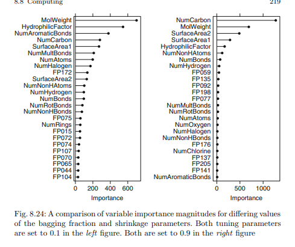

Some of these models take a long time to train so we'll use `doParallel` to make it faster
```{r doParallel, warning=FALSE, message=FALSE}
library(doParallel)

cluster <- makeCluster(
  detectCores() - 1
)

registerDoParallel(
  cluster
)
```
# 8.1
Recreate the simulated data from Exercise 7.2:

```{r 8.1_pre_step, fig.width=10, warning=FALSE}
library(mlbench)
set.seed(200)
simulated <- mlbench.friedman1(200, sd = 1)
simulated <- cbind(simulated$x, simulated$y)
simulated <- as.data.frame(simulated)
colnames(simulated)[ncol(simulated)] <- "y"
```

#### (a) Fit a random forest model to all of the predictors, then estimate the variable importance scores:

```{r 8.1a_prestep, fig.width=10, warning=FALSE, message=FALSE}
library(randomForest)
library(caret)
model1 <- randomForest(
  y ~ .,
  data = simulated,
  importance = TRUE,
  ntree = 1000
)
rfImp1 <- varImp(model1, scale = FALSE)

rfImp1
```

Did the random forest model significantly use the uninformative predictors (`V6` - `V10`)?

From the above list, we can see that `V6` - `V10` were not significant in the model given their low "Overall" score.

#### (b) Now add an additional predictor that is highly correlated with one of the informative predictors. For example:

```{r 8.1b_prestep, fig.width=10}
simulated$duplicate1 <- simulated$V1 + rnorm(200) * .1
cor(simulated$duplicate1, simulated$V1)
```

Fit another random forest model to these data. Did the importance score for V1 change? What happens when you add another predictor that is also highly correlated with V1?

```{r 8.1b_model_creation, fig.width=10}
model2 <- randomForest(
  y ~ .,
  data = simulated,
  importance = TRUE,
  ntree = 1000
)

varImp(model2, scale = FALSE)
```

Comparing the results of the first model and the second model, we can see that `duplicate1` is pretty significant and that the importance of `V1` decreased.

```{r 8.1b_adding_another, fig.width=10}
simulated$duplicate2 <- simulated$V1 + rnorm(200) * .1

model3 <- randomForest(
  y ~ .,
  data = simulated,
  importance = TRUE,
  ntree = 1000
)

varImp(model3, scale = FALSE)
```

When adding a second duplicate, we see that the importance of `V1` decreases again as well as the weight of `duplicate1`.

#### (c) Use the `cforest` function in the `party` package to fit a random forest model using conditional inference trees. The `party` package function `varimp` can calculate predictor importance. The `conditional` argument of that function toggles between the traditional importance measure and the modified version described in Strobl et al. (2007). Do these importances show the same pattern as the traditional random forest model?

```{r 8.1c_cforest, fig.width=10, warning=FALSE}
library(party)

simulated <- simulated[, c(1:11)]

model4 <- cforest(
  y ~ .,
  data = simulated
)

varimp(model4, conditional = TRUE)
```

Yes, they're similar to the first model where `V1`, `V2`, `V4`, and `V5` were much more important than the rest.

#### (d) Repeat this process with different tree models, such as boosted trees and Cubist. Does the same pattern occur?

**Boosted Trees**
```{r 8.1d_boosted_forest, fig.width=10, warning=FALSE}
library(gbm)

global_tr_control <- trainControl(method = "cv", allowParallel = TRUE)

boost_tree_grid <- expand.grid(
  .interaction.depth = seq(1, 7, by = 1),
  .n.trees = seq(100, 1000, by = 50),
  .shrinkage = c(.01, .5, by = .05),
  .n.minobsinnode = c(5:15)
)

boost_fit <- train(
  simulated[, c(1:10)],
  simulated$y,
  method = "gbm",
  tuneGrid = boost_tree_grid,
  verbose = FALSE,
  trControl = global_tr_control
)

varImp(boost_fit, scale = FALSE)
```

Using Boosted Trees, we see that the the same variables are the most important.

**Cubist**

```{r 8.1d_cubist, fig.width=10, warning=FALSE}
library(Cubist)

cubist_fit <- cubist(
  simulated[, c(1:10)],
  simulated$y
)

varImp(cubist_fit, scale = FALSE)
```

Again using the cubist model, we can see that the same variables are the most important. Here though the other variables importance was set to 0.

# 8.2

Use a simulation to show tree bias with different granularities.

We'll create a series of numbers with different levels of grannularity where:

- c1 is in the .1 range
- c2 is in the .01 range

and so on until the 5th, most grannular level.

```{r 8.2_sim_tree, warning=FALSE}
library(rpart)
library(partykit)
set.seed(19940211)

c1 <- sample(1:10 / 10, 2000, replace = TRUE)
c2 <- sample(1:100 / 100, 2000, replace = TRUE)
c3 <- sample(1:1000 / 1000, 2000, replace = TRUE)
c4 <- sample(1:10000 / 10000, 2000, replace = TRUE)

y <- c1 + c2 + c3 + c4 + rnorm(100, mean = 0, sd = 1.5)

train_tree_data <- data.frame(c1, c2, c3, c4, y)

sim_tree_fit <- rpart(
  y ~ .,
  data = train_tree_data
)

plot(as.party(sim_tree_fit))

varImp(sim_tree_fit, scale = FALSE)
```

The simulation above is fairly random and we can see from the returned data from `varImp()` that each variable is relatively similar in importance.

# 8.3

In stochastic gradient boosting the bagging fraction and learning rate will govern the construction of the trees as they are guided by the gradient. Although the optimal values of these parameters should be obtained through the tuning process, it is helpful to understand how the magnitudes of these parameters affect magnitudes of variable importance. Figure 8.24 provides the variable importance plots for boosting using two extreme values for the bagging fraction (0.1 and 0.9) and the learning rate (0.1 and 0.9) for the solubility data. The left-hand plot has both parameters set to 0.1, and the right-hand plot has both set to 0.9:




#### (a) Why does the model on the right focus its importance on just the first few of predictors, whereas the model on the left spreads importance across more predictors?

The model on the right (bagging fraction = 0.9 and shrinkage = 0.9) focuses its importance on the first few predictors because the high learning rate causes the model to converge quickly on some of the most powerful independent predictors. Additionally, because of the high bagging fraction, the model is selecting very large subsets when bootstrapping meaning that the samples are not very diverse.

#### (b) Which model do you think would be more predictive of other samples?

I belive that the model on the left will be more predictive because the parameters selected would make it better at generalizing across diverse samples.

#### (c) How would increasing interaction depth affect the slope of predictor importance for either model in Fig. 8.24?

Increasing the interaction depth would functionally increase the maximum number of nodes on the tree. This would incrase the slope.

# 8.7

Refer to Exercises 6.3 and 7.5 which describe a chemical manufacturing process. Use the same data imputation, data splitting, and pre-processing steps as before and train several tree-based models:

```{r 8.7_get_data, fig.width=10, warning=FALSE}
library(AppliedPredictiveModeling)
data(ChemicalManufacturingProcess)

sum(is.na(ChemicalManufacturingProcess[, -c(1)]))

# Removing entries with low variance
ChemicalManufacturingProcess <- ChemicalManufacturingProcess[, -nearZeroVar(ChemicalManufacturingProcess)]

# Filling NAs using KNN
knn_impute <- preProcess(
  ChemicalManufacturingProcess[, -c(1)],
  method = "knnImpute"
)

cmp_independent <- predict(
  knn_impute,
  ChemicalManufacturingProcess[, -c(1)]
)

cmp_dependent <- ChemicalManufacturingProcess[, c(1), drop = FALSE]

sum(is.na(cmp_independent[, -c(1)]))

set.seed(19940211)
# Partition the data into a sample of 80% of the full dataset
cmp_train_rows <- createDataPartition(
  cmp_independent$BiologicalMaterial01,
  p = 0.8,
  list = FALSE
)

# Use the sample to create a training dataset
cmp_train_ind <- cmp_independent[cmp_train_rows, ]
cmp_train_dep <- cmp_dependent[cmp_train_rows]

# Use the sample to create a testing dataset
cmp_test_ind <- cmp_independent[-cmp_train_rows, ]
cmp_test_dep <- cmp_dependent[-cmp_train_rows]
```

#### (a) Which tree-based regression model gives the optimal resampling and test set performance?

**Single Tree**

```{r 8.7_single_tree, fig.width=10}
cmp_stree_fit <- train(
  cmp_train_ind,
  cmp_train_dep,
  method = "rpart2",
  tuneLength = 10,
  trControl = global_tr_control
)

cmp_stree_pred <- predict(
  cmp_stree_fit,
  cmp_test_ind
)

postResample(
  cmp_stree_pred,
  cmp_test_dep
)
```

**Bagged Trees**

```{r 8.7_bagged_tree, warning=FALSE}
library(ipred)

cmp_bag_fit <- ipredbagg(
  cmp_train_dep,
  cmp_train_ind
)

cmp_bag_pred <- predict(
  cmp_bag_fit,
  cmp_test_ind
)

postResample(
  cmp_bag_pred,
  cmp_test_dep
)
```

**Random Forest**

```{r 8.7_random_forest, warning=FALSE}
library(randomForest)

cmp_randforest_fit <- randomForest(
  cmp_train_ind,
  cmp_train_dep,
  importance = TRUE,
  ntree = 1000
)

cmp_randforest_pred <- predict(
  cmp_randforest_fit,
  cmp_test_ind
)

postResample(
  cmp_randforest_pred,
  cmp_test_dep
)
```

**Boosted Trees**

```{r 8.7_boosted_animals, warning=FALSE}
boosted_animals <- train(
  cmp_train_ind,
  cmp_train_dep,
  method = "gbm",
  tuneGrid = boost_tree_grid,
  verbose = FALSE,
  trControl = global_tr_control
)

boosted_pred <- predict(
  boosted_animals,
  cmp_test_ind
)

postResample(
  boosted_pred,
  cmp_test_dep
)
```

**Cubist**

```{r 8.7_cubist, warning=FALSE}
cmp_cubist_fit <- cubist(
  cmp_train_ind,
  cmp_train_dep
)

cmp_cubist_pred <- predict(
  cmp_cubist_fit,
  cmp_train_ind
)

postResample(
  cmp_cubist_pred,
  cmp_test_dep
)
```

Our bagged tree provided the best results with an $R^2$ of 0.683 and the lowest RMSE and MAE of 1.28 and 1.17, respectively. The majority of the other models had similar RMSE and MAE scores but most had significantly lower $R^2$ scores with cubist having one of less than 0.01.

#### (b) Which predictors are most important in the optimal tree-based regression model? Do either the biological or process variables dominate the list? How do the top 10 important predictors compare to the top 10 predictors from the optimal linear and nonlinear models? 

```{r 8.7b_imporance, warning=FALSE}
library(dplyr)

varImp(cmp_bag_fit) |>
  arrange(desc(Overall)) |>
  head(10)
```

In the bagged tree model, the biological material and manufacturing process predictors both comprised about half of the top 10. In our previous PLS model, the manufacturing process dominated both the PLS and KNN models that we determined were the best in the other models.

#### (c) Plot the optimal single tree with the distribution of yield in the terminal nodes. Does this view of the data provide additional knowledge about the biological or process predictors and their relationship with yield?

```{r 8.7c_plotting_tree, warning=FALSE, fig.width=10}
library(rpart.plot)

rpart.plot(
  cmp_stree_fit$finalModel,
  type = 4
)
```

```{r stop_parallel, warning=FALSE, message=FALSE}
stopCluster(cluster)
registerDoSEQ()
```